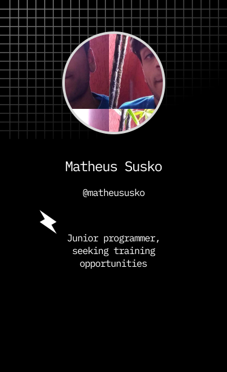

   

<h1 align="left">Hi , I'm Matheus Susko</h1>

  

- 🔥 Junior Dev, programming for web & app

- 🔭 I'm currently unemployed

<!-- - 👨‍💻 All of my projects are available at [matheususko.dev](https://matheususko.dev) -->

- 💬 Ask me about **JavaScript, HTML, CSS, SQL, REACT, JS**

- ⚡ Fun fact **Oneye 😜**

      

## 🛠 &nbsp;Tech Stack

&nbsp;
&nbsp;
&nbsp;
&nbsp;
&nbsp;
&nbsp;
&nbsp;
&nbsp;

  

## ⚙️ &nbsp;GitHub Analytics

  

## 💙 &nbsp;Social Links

<!--
**matheususko/matheususko** is a ✨ _special_ ✨ repository because its `README.md` (this file) appears on your GitHub profile.

Here are some ideas to get you started:

- 🔭 I’m currently working on ...
- 🌱 I’m currently learning ...
- 👯 I’m looking to collaborate on ...
- 🤔 I’m looking for help with ...
- 💬 Ask me about ...
- 📫 How to reach me: ...
- 😄 Pronouns: ...
- ⚡ Fun fact: ...
-->
